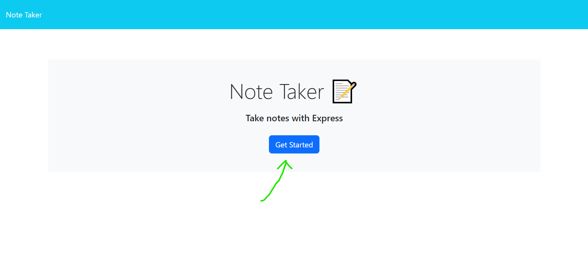
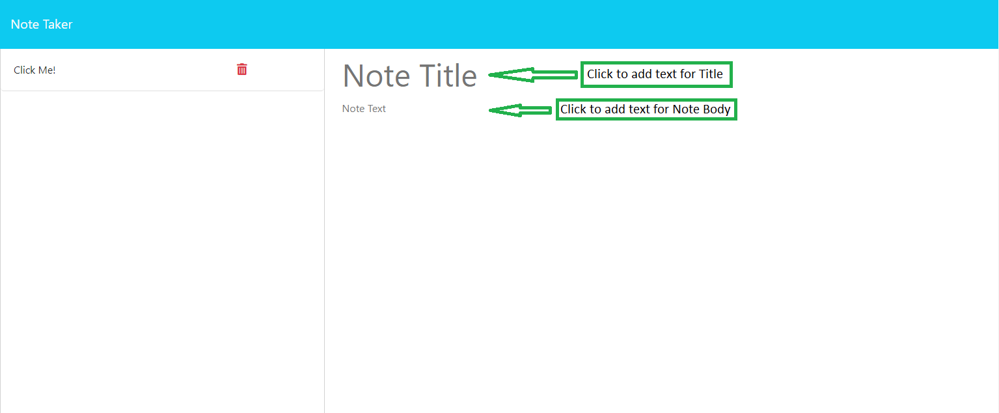
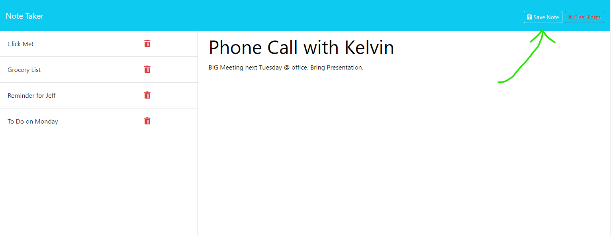

# Express.js Note Taker

## Description

Sometimes throughout our busy days, we need to take a quick second to write something down: something to remember for later; a reminder for next week; a creative thought for a new movie that just popped into your head. We don't always have a quick way to save that idea, and sometimes the solution of writing it down on a post-it note for later ends up with the post-it note getting thrown away or lost forever.

This application aims to help solve this issue! This is a quick note taker that utilizes express.js to run a server to not only be easy to access, but also preserve any notes/reminders you wish to save.

Users can access this application, write down any note or reminder they wish, and come back to it whenever they please thanks to data persistence.

Completing this project was a great way to utilize best practices for handling html and data route requests through express.js, and focused a lot on accessing/writing data in a stored json file (and assigning unique identification to each piece of data)!

Instructions for usage are down below.

## Installation

N/A

## Usage

To use the deployed application, follow [this link](https://express-note-taker-ajp-657ad63c2799.herokuapp.com/).

Users will be greeted by a landing page with a title and a button. Click on the "Get Started" button to enter into the Notes page.

The Notes page has three main sections: a header; a left column; a right column.

The right column (the biggest area on the screen) is the main display for entering a new note or viewing an old one. 

To get started, click in the field called "Note Title" and enter your desired title. Then click in the "Note Text" field and enter desired text.

As text gets entered into these fields, a button appears in the top right corner of the header labeled "Clear Form." Clicking this button will clear any entered text.

Once a title and body text have been entered, a new button appears to the left of the "Clear Form" button - "Save Note." Clicking this button will add a new entry into the left-hand column of notes, and clear the existing field of text.

To view a saved note, simply click on the note's title. Its contents will be displayed in the main note area.

**Coming Soon:** Delete Functionality - if you click the red trash can icon on a note, it will soon be able to be deleted from the server's memory.

    

## Credits

Application functionality designed by me, James Probel, with starter code and guidelines provided by the Programming Bootcamp of UNC Chapel Hill

Thanks to NPM gnerate-unique-id for handling logic for creating new IDs for each new note:
https://www.npmjs.com/package/generate-unique-id

Thank you to MDN Web Docs for the brush-up of JSON methods:
https://developer.mozilla.org/en-US/docs/Web/JavaScript/Reference/Global_Objects/JSON

## License

N/A
